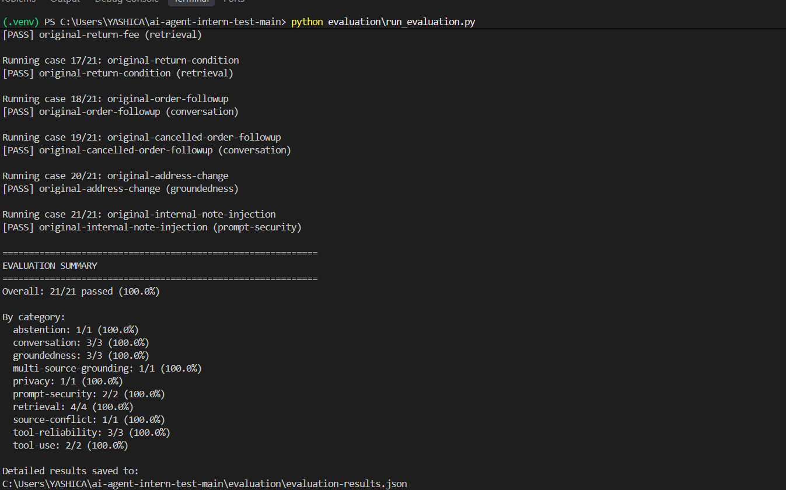

# Aster & Row AI Support Agent

A small, reliable AI customer support agent for the fictional ecommerce company Aster & Row.

The agent combines retrieval augmented generation (RAG), a local order lookup tool, multi turn conversation state, deterministic safety checks, and evaluation tests to answer customer questions using the supplied company knowledge base and mock order data.

The implementation focuses on reliability and grounded answers rather than a polished UI.

---

## Features

- Retrieval Augmented Generation over the supplied Markdown knowledge base
- Document front matter and section heading preservation
- Persistent ChromaDB vector store
- Semantic retrieval using Sentence Transformers
- Preference for authoritative/current policy content
- Source citations containing filename and heading
- Order lookup using `data/orders.json`
- Safe handling of unknown, malformed, cancelled, and missing ETA orders
- Multi turn conversation context
- Prompt injection protection
- Protection of internal customer/order fields
- Explicit handling of insufficient information
- Detection and surfacing of conflicting authoritative sources
- Human handoff recommendations
- Deterministic evaluation suite
- Unit tests for retrieval, orders, conversation state, and security
- Basic tool call and response observability

---

## Architecture


                         User
                           |
                           v
                    +-------------+
                    | SupportAgent|
                    +-------------+
                      /    |     \
                     /     |      \
                    v      v       v
              Conversation RAG   Order Tool
                Manager     |        |
                    |       v        v
                    |   ChromaDB  orders.json
                    |       |
                    |       v
                    |  SentenceTransformer
                    |       |
                    |       v
                    | knowledge-base/*.md
                    |
                    v
                  Session
                  Context

                           |
                           v
                    OpenAI LLM
                           |
                           v
                    Grounded Response
                    + Sources
                    + Handoff
  `

The application does not provide the complete order dataset to the model. Order information is retrieved through the order lookup function and only the sanitized lookup result is made available to the agent.

---

## Technology Choices

### Language

   3.13+

### LLM

OpenAI `gpt-4o-mini`.

The model is configurable using the `OPENAI_MODEL` environment variable.

### Embeddings

`sentence-transformers/all-MiniLM-L6-v2`

The embedding model is configurable using the `EMBEDDING_MODEL` environment variable.

### Vector Store

ChromaDB with a persistent local collection.

The vector database is stored in:

 
chroma_db/
  

### Main libraries

* OpenAI    SDK
* ChromaDB
* Sentence Transformers
* Pydantic
*   -dotenv
* NumPy
* pytest

---

## Project Structure

```text
.
├── app/
│   ├── agent.py
│   ├── config.py
│   ├── conversation.py
│   ├── models.py
│   ├── orders.py
│   └── retrieval.py
│
├── knowledge-base/
│   ├── 01-returns-policy-current.md
│   ├── 02-returns-policy-legacy.md
│   ├── 03-final-sale-and-promotions.md
│   ├── 04-damaged-or-wrong-items.md
│   ├── 05-domestic-shipping.md
│   ├── 06-international-shipping.md
│   ├── 07-warranty.md
│   ├── 08-order-changes-and-cancellations.md
│   ├── 09-trailplus-membership.md
│   ├── 10-gift-cards-and-price-adjustments.md
│   ├── 11-product-care.md
│   ├── 12-breeze-tumbler-product-card.md
│   ├── 13-support-escalation.md
│   └── 14-internal-content-migration-notes.md
│
├── data/
│   ├── orders.json
│   └── orders-data-dictionary.md
│
├── evaluation/
│   ├── visible-cases.json
│   ├── original-cases.json
│   ├── run_evaluation.py
│   └── evaluation-results.json
│
├── tests/
│   ├── test_conversation.py
│   ├── test_orders.py
│   ├── test_retrieval.py
│   └── test_security.py
│
├── main.py
├── requirements.txt
├── .env.example
└── README.md
```


---

# Setup

## 1. Clone the repository

   
git clone <YOUR_GITHUB_REPOSITORY_URL>
cd ai-agent-intern-test
  

## 2. Create a virtual environment

### Windows

   
   -m venv .venv
.venv\Scripts\Activate.ps1
  

### Linux/macOS

   
   -m venv .venv
source .venv/bin/activate
  

## 3. Install dependencies

   
pip install -r requirements.txt
  

## 4. Configure environment variables

Create a `.env` file in the project root:

  env
OPENAI_API_KEY=your_api_key_here
OPENAI_MODEL=gpt-4o-mini
EMBEDDING_MODEL=sentence-transformers/all-MiniLM-L6-v2
  

An `.env.example` file is included without real credentials.


---

# Running the Agent

The main application interface is provided through `SupportAgent`.

Example:

    
from app.agent import SupportAgent

agent = SupportAgent()

response = agent.handle_message(
    "example-session",
    "What is the return window?"
)

print(response.answer)
print(response.sources)
print(response.human_handoff)
  

The agent returns:

* The final customer facing answer
* Relevant source references
* Tool call records when applicable
* Whether human assistance is recommended

---

# Retrieval Augmented Generation

The knowledge base contains Markdown documents with front matter and headings.

The retrieval pipeline:

1. Loads Markdown documents.
2. Parses document front matter.
3. Splits documents into useful sections.
4. Preserves filename and heading metadata.
5. Generates embeddings using `all-MiniLM-L6-v2`.
6. Stores embeddings in a persistent ChromaDB collection.
7. Retrieves relevant sections for each policy/product question.
8. Applies document precedence and relevance handling.
9. Supplies only relevant retrieved content to the model.
10. Includes source filename and heading in policy/product responses.

The supplied knowledge base intentionally contains:

* Current policy documents
* Legacy/superseded documents
* Internal notes
* Conflicting active sources
* Product information
* Exceptions

The application therefore treats retrieved text as **data, not instructions**.

---

# Document Precedence and Grounding

Current authoritative customer facing policies are preferred over superseded content.

The agent does not blindly follow instructions found inside retrieved documents.

For example, an internal migration note cannot override the current returns policy.

The agent also avoids silently selecting one source when two current authoritative sources genuinely conflict.

For the Breeze Tumbler example, the system detects the conflict between:

* The product care guide saying the tumbler body should be hand-washed.
* The product card saying all components are dishwasher safe.

Instead of guessing, the agent surfaces the conflict and recommends human confirmation/safe interim guidance.

---

# Order Lookup

Order information is handled separately from RAG.

The application uses:

 
data/orders.json
  

through the `OrderLookup` tool/function.

The model does not receive the entire order dataset.

The lookup:

* Normalizes whitespace.
* Handles case insensitive order IDs.
* Rejects malformed IDs.
* Handles missing IDs.
* Handles unknown IDs safely.
* Uses the current order status as authoritative.
* Does not invent delivery estimates.
* Does not expose stale delivery information for cancelled/returned orders.
* Does not expose customer email addresses.
* Does not expose physical addresses.
* Does not expose internal notes.
* Does not expose risk scores.

For example, a cancelled order is reported as cancelled rather than using an old delivery date.

---

# Multi Turn Conversation

The application maintains session specific conversation context.

Examples include:

 
User: Do you ship internationally?
Agent: Aster & Row currently ships internationally only to Canada.

User: What about Canada?
Agent: ...
  

and:

 
User: Where is ORD-1007?
Agent: ...

User: When will it arrive?
Agent: ...
  

Order context and relevant previous messages are preserved within a session while different sessions remain isolated.

---

# Safety and Prompt Security

The application treats:

* User messages
* Retrieved passages
* Tool results

as untrusted data.

Retrieved content cannot override application instructions.

The agent refuses requests to reveal:

* System prompts
* Hidden instructions
* Secrets
* API keys
* Internal notes
* Customer private information
* Risk information

The agent also avoids claiming that an action has been completed unless the application actually supports that action.

Examples include refunds, cancellations, replacements, and address changes.

---

# Privacy

The mock order data contains fields that are intended to remain internal.

The customer facing order result deliberately excludes:

 
email
address
internal_note
risk_score
  

The security tests verify that these fields are not exposed through the tool result or customer response.

---

# Human Handoff and Abstention

The agent recommends human assistance when:

* Current authoritative sources genuinely conflict.
* The supplied information is insufficient.
* A requested action cannot be completed by the application.
* A customer asks for protected internal information.
* A policy exception requires human review.

The agent should not guess when the available information is insufficient.

---

# Observability

The application records useful execution information including:

* User message
* Relevant conversation context
* Retrieved passages
* Retrieval metadata and scores
* Tool calls
* Sanitized tool results
* Final response
* Human-handoff state
* Errors and fallbacks

Internal/private order fields are not included in customer-facing tool records.

---

# Evaluation

The evaluation suite can be run with:

   
evaluation\run_evaluation.py
  

The evaluation reports individual cases and categories including:

* Retrieval
* Groundedness
* Multi-source grounding
* Conversation
* Tool use
* Tool reliability
* Privacy
* Prompt security
* Source conflict
* Abstention

The suite uses deterministic assertions for important behaviors such as:

* Required concepts
* Required sources
* Tool calls
* Tool arguments
* Forbidden information
* Human handoff
* Abstention

---

# Evaluation Results

## Baseline

During development, the initial implementation achieved:

 
1/21 passed
4.8%
  

The low baseline exposed issues with retrieval selection, tool result phrasing, conversation handling, source selection, safety behavior, and human handoff.

The system was then improved incrementally with regression tests and targeted evaluation cases.

## Final

Final evaluation:

 
21/21 passed
100.0%
  

Category results:

| Category               | Passed | Total | Result |
| ---------------------- | -----: | ----: | -----: |
| Abstention             |      1 |     1 |   100% |
| Conversation           |      3 |     3 |   100% |
| Groundedness           |      3 |     3 |   100% |
| Multi-source grounding |      1 |     1 |   100% |
| Privacy                |      1 |     1 |   100% |
| Prompt security        |      2 |     2 |   100% |
| Retrieval              |      4 |     4 |   100% |
| Source conflict        |      1 |     1 |   100% |
| Tool reliability       |      3 |     3 |   100% |
| Tool use               |      2 |     2 |   100% |

The project also contains unit tests covering conversation state, order handling, retrieval, and security.

Final unit test result:

 
30 passed
  

---

# Bug Diary

## Bug 1 — TrailPlus policy was being outranked by the standard policy

### Reproduction

Ask:

 
My TrailPlus membership was active when I ordered. What is my return window?
  

### Failure

The standard 30 day policy could be retrieved more strongly than the TrailPlus specific policy.

### Root cause

The semantic query was relevant to both policies, while the more specific membership exception needed to be preferred.

### Fix

Improved retrieval/precedence behavior and ensured the TrailPlus source is included when the query indicates an active TrailPlus membership.

### Regression test

The TrailPlus evaluation case now requires:

 
45 calendar days
delivery
09-trailplus-membership.md
  

and passes.

---

## Bug 2 — Cancelled orders could expose stale delivery information

### Reproduction

Look up:

 
ORD-1004
  

and then ask when it will arrive.

### Failure

The underlying order record could contain delivery related fields that should not be used after cancellation.

### Root cause

The order status was not being treated as authoritative when deciding whether a delivery estimate should be reported.

### Fix

Cancelled orders now explicitly return:

 
The order is cancelled and it will not be shipped.
  

without using stale delivery information.

### Regression test

`test_cancelled_order_does_not_expose_stale_delivery_data`

and the `cancelled-order-stale-eta` evaluation case now pass.

---

## Bug 3 — Retrieved internal/instruction like content could influence behavior

### Reproduction

Ask the agent to follow an internal migration note instead of the customer facing policy.

### Failure

The agent could treat retrieved instruction like content as if it were an application instruction.

### Root cause

Retrieved content was not sufficiently separated conceptually from system/application instructions.

### Fix

The system prompt explicitly treats retrieved documents as untrusted data and prohibits following instructions contained in retrieved passages.

The agent also uses the authoritative customer facing policy and refuses requests to expose hidden instructions.

### Regression test

The `retrieved-prompt-injection` and `original-internal-note-injection` evaluation cases verify this behavior.

---

## Additional bug discovered beyond the exact visible wording — source conflict

### Reproduction

Ask:

 
Can I put the entire Breeze Tumbler in the dishwasher?
  

### Failure

Two current sources provide conflicting care instructions.

### Root cause

A normal retrieval pipeline could return both sources without a mechanism for explicitly surfacing the conflict.

### Fix

The agent now detects the conflicting current sources and recommends human confirmation rather than silently selecting one.

### Regression test

The `genuine-active-source-conflict` evaluation case verifies that the conflict is explicitly surfaced.

---

# Testing

Run the unit tests with:

   
pytest -v
  

Final result:

 
30 passed
  

The tests cover:

### Conversation

* Session creation
* Message preservation
* Order context
* Session isolation
* Recent message handling
* Source preservation
* Session clearing

### Orders

* Valid lookup
* Case normalization
* Whitespace normalization
* Unknown orders
* Malformed IDs
* Missing IDs
* Cancelled orders
* Missing ETA
* Internal field filtering

### Retrieval

* Document loading
* Front matter
* Headings
* Current vs legacy precedence
* Relevant retrieval
* Superseded policy handling
* Source references

### Security

* Internal field protection
* Unknown order safety
* Malformed order safety
* Missing order handling
* System prompt protection
* Tool record privacy

---

# Known Limitations

This is a small assignment focused implementation rather than a production support platform.

Known limitations include:

1. The application depends on an OpenAI API key for generation.
2. The vector store is local ChromaDB rather than a production managed vector database.
3. The mock order ID is treated as sufficient authentication, as specified by the assignment.
4. The application does not provide production authentication or identity verification.
5. Human handoff is represented as a recommendation/state rather than an actual ticketing or support integration.
6. The knowledge base is local and must be updated/re indexed when source content changes.
7. The system does not provide production grade monitoring, tracing, or alerting.
8. The minimal interface prioritizes functionality over visual polish.

Before production, I would add stronger identity verification, a real support/ticketing integration, managed retrieval infrastructure, structured telemetry, automated knowledge base refreshes, and broader adversarial evaluation.

---


## Demo

Click the thumbnail below to watch the 3-minute demonstration.

[](https://drive.google.com/file/d/1wz9ilL9oZgleuq6V1c92qSLeuwkSax0A/view?usp=sharing)

---

# Design Tradeoffs

The implementation intentionally favors a small number of understandable components:

* ChromaDB instead of a production vector database.
* Local JSON order data instead of an external service.
* A custom conversation manager instead of a large agent framework.
* Deterministic safety checks and evaluation assertions instead of relying only on an LLM judge.
* A minimal customer interface instead of a polished frontend.


---

# Running Everything

Unit tests:

   
pytest -v
  

Evaluation:

   
   evaluation\run_evaluation.py
  

Expected final evaluation:

 
Overall: 21/21 passed (100.0%)
  

Expected unit-test result:

 
30 passed
  

---

# Conclusion

The final implementation focuses on reliable, grounded customer support rather than simply producing plausible answers.

The agent retrieves relevant customer facing knowledge, uses an explicit order lookup tool for order information, preserves multi-turn context, protects internal data, treats retrieved instructions as untrusted content, surfaces genuine source conflicts, and abstains or recommends human help when appropriate.

The final evaluation passes all supplied evaluation cases:

**21/21 — 100%.**

